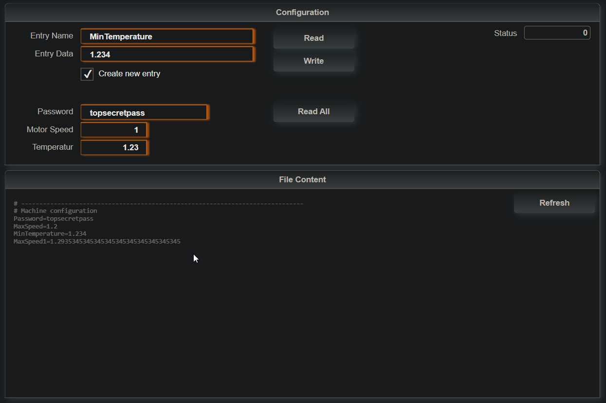

## Table of Contents

* [Introduction](#Introduction)
* [Requirements](#Requirements)
* [Pre-Configuration](#Pre-Configuration)
* [Error numbers](#Errors)
* [Revision History](#Revision-History)

<a name="Introduction"></a>

## Introduction

This is a library "mod_cfg" for reading and writing from a configuration file. The configuration file should be a plain text file with the following format

``` 
# ------------------------------------------------------------------------------
# Machine configuration
Password=topsecretpass
MaxSpeed=123
MinTemperature=1.234
```

The first value is the entry name followed by the data. The library reads and writes data as string. Number variables must be converted accordingly. The configuration file can be stored on the user partition on the PLC. The project also contains a sample task, config file and mappView visualization for demo purpose.



The library contains only one function call "fct_cfg" that receives a pointer to a variable structure. The type of this structure is "cfg_typ". The structure includes all necessary parameters and has following members:

<table>
  <tr style="font-weight:bold" >
    <th>Name</th>
    <th>Level Description</th>
  </tr>
  <tr>
   <td>read</td>
   <td>Read a configuration entry</td>
  </tr>
  <tr>
   <td>write</td>
   <td>Write a configuration entry</td>
  </tr>
    <tr>
   <td>device</td>
   <td>File device name as pointer</td>
  </tr>
    <tr>
   <td>file_name</td>
   <td>File name as pointer</td>
  </tr>
    <tr>
   <td>entry</td>
   <td>Name of the entry as string</td>
  </tr>
    <tr>
   <td>data</td>
   <td>Entry data as string</td>
  </tr>
    <tr>
   <td>option</td>
   <td>On write command create new entry if it does not exist</td>
  </tr>
    <tr>
   <td>internal</td>
   <td>Internal data structure</td>
  </tr>

</table>

<a name="Requirements"></a>

## Requirements

* Automation Studio 4.7
* Automation Runtime C4.73

Recommended task class is #8 with a 10ms cycle time.

<a name="Pre-Configuration"></a>

## Pre-Configuration
The sample can be pre-configured through the following constants located in 
mappFileExplorer->ExplorerVariables.var

| Constant | Default | Text |
|---|---|---|
| BUFFER_SIZE | 100000 | Maximum size of the buffer and therefore the limit for the file size |
| DATA_SIZE | 200 | Maximum length of one entry |
| ENTRY_SIZE | 50 | Size of the entry name string |

<a name="Errors"></a>
## Error
The sample generates the following list of error messages. All other error numbers are generated from included libraries that can be found in the Automation Studio help.

| No | Constant | Text |
|---|---|---|
| 50000 | ERR_DEVICE_EMPTY | Device name is empty |
| 50001 | ERR_ENTRY_EMPTY | Entry name is empty |
| 50010 | ERR_FILE_SIZE | Config file size exceeds buffer size, increase BUFFER_SIZE |
| 50011 | ERR_BUFFER_SIZE | New data exceeds the buffer size, increase BUFFER_SIZE |
| 50012 | ERR_DATA_SIZE | Read data exceeds the size of the data variable, increase DATA_SIZE |
| 50020 | ERR_ENTRY_NOT_FOUND | Entry was not found in file |

<a name="Revision-History"></a>

## Revision History

#### Version 1.0

* Initial commit
